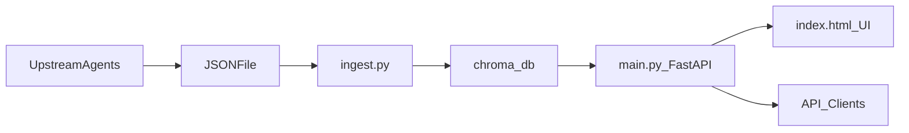

## FDA Drug Shortage RAG — Teammate Setup Guide

**This repo is the RAG backend and UI only.**  
Your agents live elsewhere, produce a JSON file, and drop it where this repo can see it. This README explains exactly how to:

- **Install and run** the RAG stack locally.
- **Point it at your agents’ JSON output**.
- **Ingest data → build the vector store → query via UI or API**.

---

## Architecture at a Glance

- **Agents / upstream pipeline**: Your team’s agents call FDA (or other) sources and write out a JSON file.
- **Ingestion (`ingest.py`)**: Reads that JSON file, turns each record into text, embeds it, and writes a local **Chroma** vector store in `chroma_db/`.
- **Backend (`main.py`)**: FastAPI app that loads the vector store and a local Ollama model, exposes `/chat` and `/status`, and serves the UI.
- **Frontend (`index.html`)**: Single-page chat UI that talks to `/chat` and shows retrieved records.

High-level flow:



---

## Prerequisites

- **OS**: macOS (current workflow is tested on Mac; Linux/WSL may work with minor tweaks).
- **Python**: **3.10+**
  - Check:

    ```bash
    python3 --version
    ```

- **Git**:

  ```bash
  git --version
  ```

- **Ollama + model**:
  - Install Ollama from `https://ollama.com`.
  - In Terminal:

    ```bash
    ollama pull llama3.2
    ```

    This is a ~2 GB one-time download; it is cached afterward.

---

## Installation

These steps are what a teammate should do after cloning/forking this repo.

### 1. Clone the repo

From any directory where you keep code:

```bash
git clone <your-fork-or-repo-url>
cd rag_fda_prototype
```

If you already have this directory from another source (ZIP, copy), just `cd` into it.

### 2. Create and activate a virtualenv

```bash
python3 -m venv .venv
source .venv/bin/activate
```

You should now see `(.venv)` at the start of your shell prompt.  
You need to run `source .venv/bin/activate` **in every new terminal session** before using this project.

### 3. Install Python dependencies

With the venv active:

```bash
pip install -r requirements.txt
pip install -U langchain-core langchain langchain-huggingface langchain-ollama
```

This installs FastAPI, Chroma, LangChain, and the modern split-out LangChain integrations used in `main.py` and `ingest.py`.

---

## How Your Agents Plug In

Your agents are responsible for **creating a JSON file**. This repo is responsible for **ingesting that file and serving RAG over it**.

### 1. Where agents should write JSON

- Simplest: write a file into the **project root** (same folder as `main.py` and `ingest.py`), for example:
  - `drug-shortages-YYYY-MM-DD.json`
  - or reuse the provided sample: `drug-shortages-0001-of-0001.json`
- The ingestion script accepts **any path**:

  ```bash
  python ingest.py --file path/to/your_agents_output.json
  ```

  So agents can also write to another directory as long as teammates pass that path into `ingest.py`.

### 2. Expected JSON shape

`ingest.py` is intentionally tolerant. It expects one of:

- A **list of records**:

  ```json
  [
    { "...": "..." },
    { "...": "..." }
  ]
  ```

- An **object that wraps a list** under any of the keys:
  - `results`
  - `data`
  - `records`
  - `shortages`

  Example:

  ```json
  {
    "results": [
      { "...": "..." },
      { "...": "..." }
    ]
  }
  ```

If a dict is passed without those keys, `ingest.py` will fall back to the **first list-valued field** it finds. As a last resort, it will wrap a single record dict into a list.

### 3. Fields that work best with this pipeline

Each record becomes a LangChain `Document` with:

- A human-readable text chunk (all fields are rendered as `Label: value` lines).
- Metadata used in answers:
  - `generic_name`
  - `brand_name` (from `openfda.brand_name[0]` if present)
  - `status` (prefers `availability`, falls back to `status`)
  - `updated` (`update_date`)

To get the most out of the UI and `/chat` responses, **have your agents populate these fields whenever possible**:

- **Top-level fields** (preferred):

  ```json
  {
    "generic_name": "lorazepam",
    "availability": "currently in shortage",
    "update_date": "2026-03-01",
    "shortage_reason": "manufacturing delays",
    "company_name": "Example Pharma Inc."
  }
  ```

- Optional but recommended nested field:

  ```json
  {
    "openfda": {
      "brand_name": ["Ativan"]
    }
  }
  ```

Any other fields are still ingested and rendered as lines in the text chunk, so agents are free to attach extra attributes — they will simply appear in the context the model sees.

### 4. Stability guarantees for agents

- As long as agents output either:
  - A list of dicts, or
  - A dict with `results`/`data`/`records`/`shortages` as a list,

they do **not** need to change when this repo is forked or moved. Only the **path and filename** passed into `ingest.py` need to be agreed within the team.

---

## Building the Vector Store (Ingestion)

Run ingestion **whenever your agents produce a fresh JSON file**.

From the project root, with venv active:

```bash
python ingest.py --file path/to/your_agents_output.json
```

What this does:

- Loads the JSON.
- Converts each record into a readable text summary.
- Generates embeddings with the `all-MiniLM-L6-v2` sentence-transformer.
- Writes a persistent Chroma vector store to `./chroma_db` in the project root.

Notes:

- If `chroma_db/` already exists, `ingest.py` **deletes and recreates it**. This is intentional: running ingestion always reflects the latest JSON your agents produced.
- On the first run, the embedding model download can take a minute; subsequent runs reuse the cached model.

---

## Running the API and UI

### 1. Start the FastAPI server

With `.venv` activated and after a successful ingestion (so `chroma_db/` exists):

```bash
uvicorn main:app --reload
```

Uvicorn will listen on `http://127.0.0.1:8000` by default.

### 2. Use the browser UI

- Open:

  ```text
  http://127.0.0.1:8000/
  ```

- This loads `index.html`, which lets you:
  - Ask natural-language questions about the shortage data.
  - See the AI answer.
  - See which records were retrieved and used as sources.

### 3. Check backend status

- Hit the status endpoint:

  ```text
  http://127.0.0.1:8000/status
  ```

- Response fields:
  - `db_ready` — whether `chroma_db/` exists and can be opened.
  - `records_indexed` — number of records in the vector store.
  - `llm_model` / `embed_model` — configured model names.

### 4. Call the `/chat` API directly

Example `curl`:

```bash
curl -X POST http://127.0.0.1:8000/chat \
  -H "Content-Type: application/json" \
  -d '{"question": "Which oncology drugs are currently in shortage?"}'
```

Response schema (simplified):

```json
{
  "answer": "string",
  "sources": [
    {
      "generic_name": "string",
      "brand_name": "string",
      "status": "string",
      "updated": "string"
    }
  ],
  "model": "llama3.2",
  "chunks_retrieved": 6
}
```

---

## Configuration Reference

Configuration lives in code, not environment variables.

- In `ingest.py`:
  - `CHROMA_DIR = "./chroma_db"`
  - `EMBED_MODEL = "all-MiniLM-L6-v2"`
  - `COLLECTION = "fda_shortages"`
- In `main.py`:
  - `CHROMA_DIR = "./chroma_db"`
  - `COLLECTION = "fda_shortages"`
  - `EMBED_MODEL = "all-MiniLM-L6-v2"`
  - `OLLAMA_MODEL = "llama3.2"`
  - `TOP_K = 6`

Guidance:

- If you change `CHROMA_DIR` or `COLLECTION`, **change it in both files** and re-run ingestion.
- If you change `OLLAMA_MODEL`, make sure to `ollama pull <new-model-name>` first.

---

## Troubleshooting

- **Server says “Vector store not found. Run: python ingest.py --file your_fda_file.json”**
  - You have not run ingestion, or it failed.
  - Fix: run `python ingest.py --file path/to/your_agents_output.json` and confirm `chroma_db/` exists.

- **`/status` shows `db_ready: false`**
  - Same as above; ingestion hasn’t produced a usable `chroma_db/`.
  - Fix: re-run ingestion, check for JSON format issues.

- **FastAPI returns 500 with “RAG error”**
  - Likely a JSON schema edge case or a corrupted vector store.
  - Fix: delete `chroma_db/` and re-ingest; confirm your JSON is valid and non-empty.

- **Ollama model errors (e.g., 404 or connection refused)**
  - Model not pulled or Ollama not running.
  - Fix:

    ```bash
    ollama pull llama3.2
    ```

    and ensure the Ollama app is open.

- **Very slow first response**
  - LLM loads into memory on first use; later queries are faster.

---

## Project File Map

```text
rag_fda_prototype/
│
├── main.py           # FastAPI backend + RAG chain (/ , /chat , /status)
├── ingest.py         # Ingestion pipeline: JSON → text → embeddings → chroma_db/
├── index.html        # Single-page chat UI served at GET /
├── requirements.txt  # Python dependencies
├── README.md         # This teammate-focused setup guide
├── drug-shortages-0001-of-0001.json  # Sample FDA JSON (optional; your agents may replace this)
└── chroma_db/        # Auto-generated Chroma vector store (created by ingest.py)
```

Teammates only need to coordinate on **where agents write JSON** and **which filename/path** they hand to `ingest.py`. Everything else (embeddings, vector DB, RAG chain, and UI) is encapsulated inside this repo.

